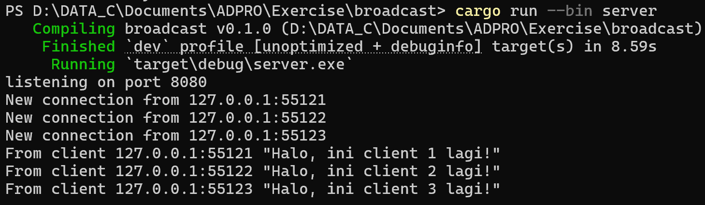

**Nama**: Wirya Dharma Kurnia    
**Kelas**: AdPro B   
**NPM**: 2306152115  

## Reflection

### 2.1: Original code, and how it run

- Server

- Client 1

- Client 2

- Client 3

- How to run server?  
Jalankan command `cargo run --bin server` pada direktori broadcast.

- How to run 3 client?  
Jalankan command `cargo run --bin client` pada direktori broadcast. Kali ini, saya menjalankan command tersebut secara terpisah pada 3 terminal berbeda.

- What happens when you type some text in the clients?  
Dari screenshot di atas kita dapat melihat bahwa ketika server dijalankan, maka server akan terhubung pada request yang masuk di port 2000. Saat client 1, client 2, dan client 3 terhubung, maka pada server akan muncul log yang memberi informasi berupa `"New connection from (port client yang masuk)"`. Dari sisi client, ketika mereka sudah terhubung dengan server maka akan ada log yang berisi `"From server: Welcome to chat! Type a message"`. Client dapat mengirimkan pesan ke server, dan server akan menerima semua pesan yang dikirim oleh setiap client. Server juga akan mengeluarkan pesan `"From client (alamat port client): (pesan yang dikirim client)"`. Sementara itu, client juga akan menerima pesan yang dikirimkan oleh client-client lain melalui server karena server akan menyimpan connection dengan setiap client sehingga mereka saling terhubung satu sama lain. 

### 2.2: Modifying port

- Server

- Client 1

- Client 2

- Client 3

- Kode yang dimodifikasi pada `server.rs`

- Kode yang dimodifikasi pada `client.rs`

- Saya melakukan modifikasi komunikai antara server dan client dengan mengubah portnya dari 2000 ke 8080. Modifikasi dilakukan di `server.rs` dan `client.rs` karena menggunakan WebSocket protocol pada sisi client dan TcPListener di sisi server, yang mengharuskan penggunaan port yang sama agar dapat berkomunikasi dengan baik. Interaksi yang muncul di terminal sama seperti sebelumnya pada bagian 2.1 karena yang diubah hanya portnya. Jika port pada server dan client berbeda, maka akan mengakibatkan error karena server harus menyimpan connections dari client pada suatu port sementara client mengirimkan request ke port lain.

